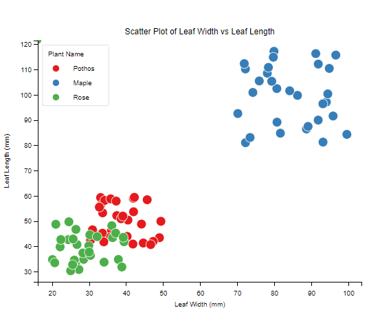
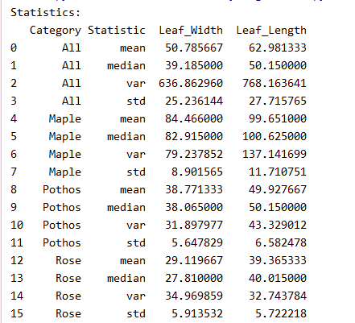

[](https://classroom.github.com/a/AV-xh9XP)
# HW2
DS5110  
Homework 2 - Data Collection  
Due 1/24/2025

__*Answer the following*__
1. ```Explain your data collection process. ```

    **Identify Plants**: Three types of plants were selected: Pothos, Maple, and Rose.

    **Collect Leaves**: For each plant, 30 healthy and mature leaves were collected.
    
    **Measure Dimensions**: Each leaf's width (at the widest point) and length (from the tip to the base) were measured using a ruler.

    **Record Data**: The measurements were recorded in a notebook, ensuring each entry included the plant name, leaf width, and leaf length.
    
    **Save Data**: The data was transferred into a .csv file with columns: Plant_Name, Leaf_Width, and Leaf_Length


2. ```What instrument did you use to collect data with? ```

    A standard ruler with millimeter (mm) markings was used to measure the leaf dimensions.


3. ```Argue the accuracy and precision of your instrument. ```
    
    The ruler is accurate to ±1 mm, which is suitable for measuring leaf dimensions. This level of accuracy is sufficient for distinguishing between the sizes of different plant leaves.The ruler allows measurements to the nearest millimeter, providing a reasonable level of precision. However, human error (e.g., misalignment of the ruler) could introduce minor variability.


4. ```How many data points did you collect? Why? ```    
    
    I have collected 90 (30 data points per plant × 3 plants).
    A sample size of 30 per plant is statistically significant for descriptive analysis and visualization. It provides enough data to observe trends and variability without being overly time-consuming to collect.


5. ```Define the size of your data in terms of both N (full data set size) and n (each subset size). ```

    **N (Full Data Set Size)**: 90 (30 data points per plant × 3 plants).
    
    **n (Each Subset Size)**: 30 (for each plant type).


7. ```Explain any problems that you ran into during the data collection process.```

    During data collection, several challenges were encountered: irregular leaf shapes (e.g., Rose) made consistent measurements difficult, so measurements were taken at the widest and longest points, and irregular leaves were excluded; confusion arose in identifying similar-looking plants, so a plant identification app was used for verification; and misalignment or parallax errors caused slight inaccuracies, so measurements were repeated to ensure consistency.

__*Analysis/Visualization*__

1. ```Graph histograms of your data with appropriate labels. ```

          

2. ```Graph boxplots of your data with appropriate labels. ```

       

3. ```Graph a scatter plot of your entire data set with each subset different color and a ledger.``` 

   

4. ```Explain each graph in terms of variance, mean, median, and standard deviation. ```

      

**Histogram of Leaf Width by Plant Type**

Maple:

      Mean (84.47 mm) and median (82.92 mm) are close, indicating a roughly symmetric distribution.
      
      High variance (79.24) and standard deviation (8.90 mm) suggest a wide spread, visible as a broad histogram range (e.g., 70–100 mm).

Pothos:

      Mean (38.77 mm) and median (38.07 mm) are nearly identical, with low variance (31.90) and standard deviation (5.65 mm), resulting in a narrow peak (30–50 mm).

Rose:

      Mean (29.12 mm) > median (27.81 mm), hinting at a slight right skew.
      
      Moderate variance (34.97) and standard deviation (5.91 mm) produce a broader distribution (20–40 mm).

**Histogram of Leaf Length by Plant Type**

Maple:

      Mean (99.65 mm) ≈ median (100.63 mm), but extremely high variance (137.14) and standard deviation (11.71 mm) indicate a wide spread (80–120 mm).

Pothos:

      Mean (49.93 mm) ≈ median (50.15 mm), with low variance (43.33) and standard deviation (6.58 mm), showing tight clustering (40–60 mm).

Rose:

      Mean (39.37 mm) ≈ median (40.02 mm), with moderate variance (32.74) and standard deviation (5.72 mm), leading to a uniform spread (30–50 mm).

**Boxplot of Leaf Width by Plant Type**

Maple:

      Long box (high IQR) due to high variance, median ~82.92 mm. Potential outliers reflect data spread.

Pothos:

      Short box (low IQR) with tight clustering, no outliers. Median ~38.07 mm.

Rose:

      Medium box (moderate IQR), slight right skew (mean > median). Median ~27.81 mm.

**Boxplot of Leaf Length by Plant Type**

Maple:

      Extremely long box (very high variance), median ~100.63 mm.

Pothos:

      Compact box (low variance), median ~50.15 mm.

Rose:

      Moderate box (medium variance), symmetric distribution (mean ≈ median).

**Scatter Plot of Leaf Width vs. Leaf Length**

Maple:

      Points spread widely in the upper-right (large leaves).
      
      Strong positive correlation (width and length increase proportionally).
      
      High variability (width SD = 8.90 mm, length SD = 11.71 mm).

Pothos:

      Points clustered tightly in the lower-left (small leaves).
      
      Weak positive correlation (limited size variation).
      
      Low variability (width SD = 5.65 mm, length SD = 6.58 mm).

Rose:

      Points scattered in the middle (medium-sized leaves).
      
      No clear correlation.
      
      Moderate variability (width SD = 5.91 mm, length SD = 5.72 mm).

5. ```What can you infer with data and graphs that you have?```
   
Based on the data and graphs, Maple exhibits the largest leaves with the highest variability, indicating adaptability to diverse outdoor conditions. Its broad distribution and strong positive correlation between width and length suggest efficient resource use in varying environments. Pothos, on the other hand, has the smallest and most consistent leaves, reflecting specialization for stable, low-light indoor settings. Its tight clustering and low variability highlight energy efficiency. Rose shows moderate variability and medium-sized leaves, balancing aesthetic appeal with adaptability, making it suitable for ornamental gardens.

The histograms and boxplots reveal clear differences in leaf size and variability among the three plants. Maple's high variability supports outdoor adaptability, Pothos' uniformity suits indoor stability, and Rose's moderate variability aligns with its ornamental role. These findings highlight how leaf morphology reflects ecological adaptation and practical applications for each plant type.